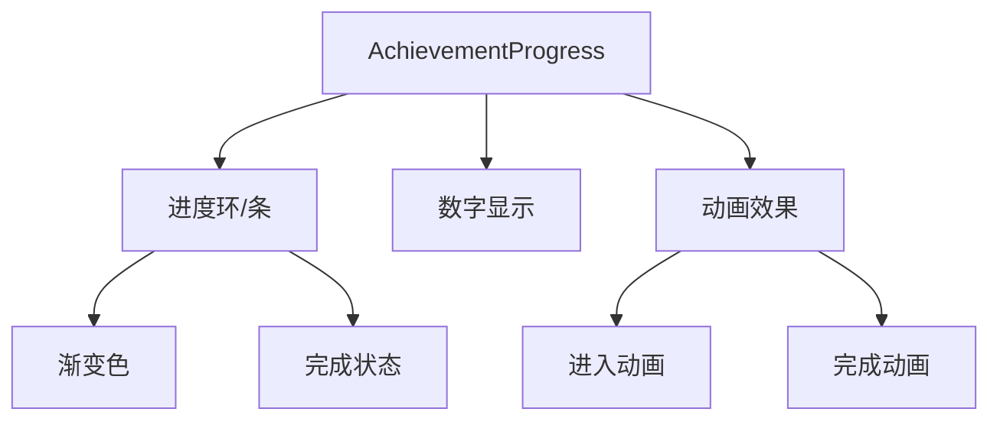

# 成就Tab UX优化 - 技术方案

## 1. 技术选型

| 技术 | 用途 |
|------|------|
| Vue 3 Composition API | 组件开发 |
| Tailwind CSS | 样式实现 |
| CSS Animation | 进度动画效果 |
| CSS Gradient | 渐变色效果 |

## 2. 架构设计

### 组件结构

```
AchievementView.vue
├── AchievementProgress.vue (新增：酷炫进度组件)
├── HeroSearch.vue
├── HeroGrid.vue / HeroList.vue
└── AchievementHeroCard.vue / HeroListCard.vue
```

### 进度组件设计



## 3. 数据结构

### 进度组件 Props

```typescript
interface AchievementProgressProps {
  completed: number    // 已完成数量
  total: number        // 总数量
  achievementName: string  // 成就名称
}
```

## 4. 接口设计

### AchievementProgress 组件

```vue
<AchievementProgress
  :completed="achProgress.completed"
  :total="achProgress.total"
  :achievement-name="selectedAchName"
/>
```

## 5. 核心逻辑

### 进度动画

```css
@keyframes progressFill {
  from { width: 0%; }
  to { width: var(--progress); }
}

@keyframes goldShimmer {
  0%, 100% { opacity: 1; }
  50% { opacity: 0.7; }
}
```

### 默认布局

```javascript
// 修改默认值为 'list'
const achLayout = useLayoutPreference('lol_achievement_layout', 'list')
```

## 6. 文件结构

### 新增文件

| 文件路径 | 职责 |
|----------|------|
| `packages/frontend/src/components/achievement/AchievementProgress.vue` | 酷炫进度组件 |

### 修改文件

| 文件路径 | 修改内容 |
|----------|----------|
| `packages/frontend/src/components/achievement/AchievementView.vue` | 集成新进度组件，修改默认布局 |
| `packages/frontend/src/styles/main.css` | 添加动画和渐变样式 |

## 7. 风险与对策

| 风险 | 对策 |
|------|------|
| 动画性能问题 | 使用 CSS transform 和 opacity，避免重排 |
| 移动端适配 | 响应式设计，缩小尺寸 |
| 浏览器兼容性 | 使用标准 CSS 属性，添加前缀 |
