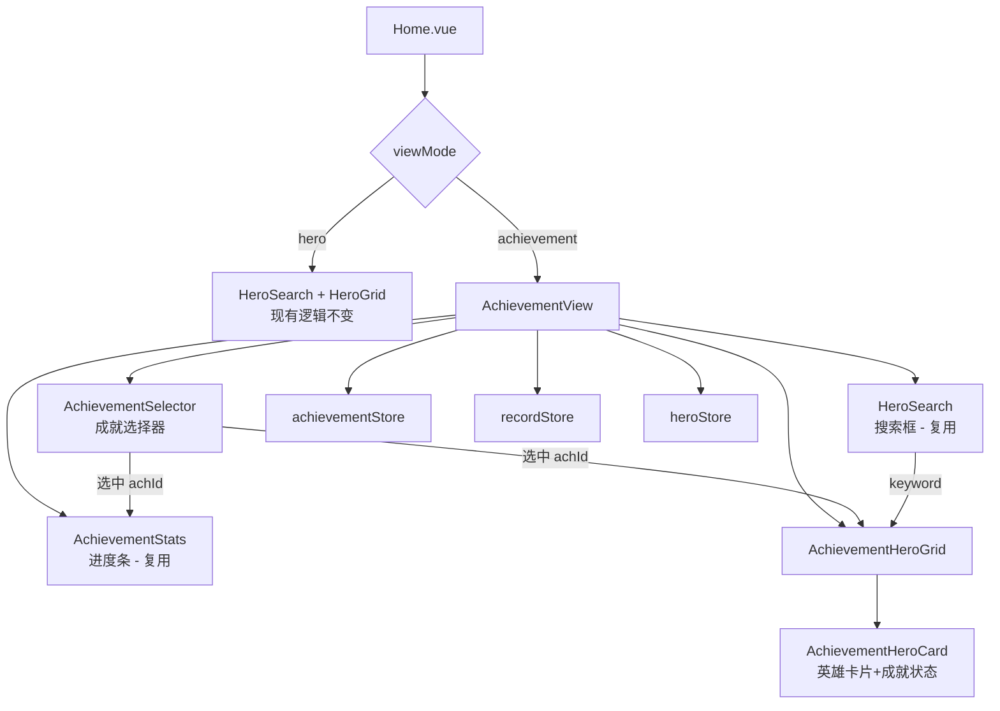
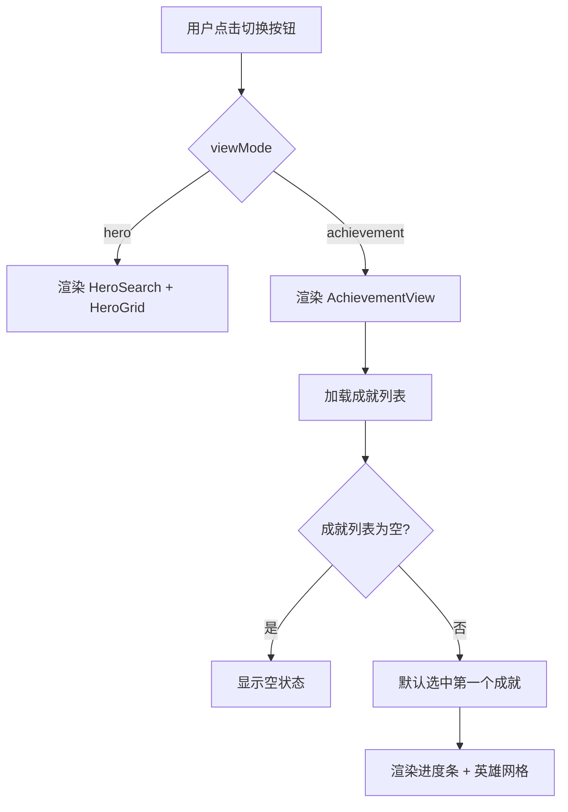
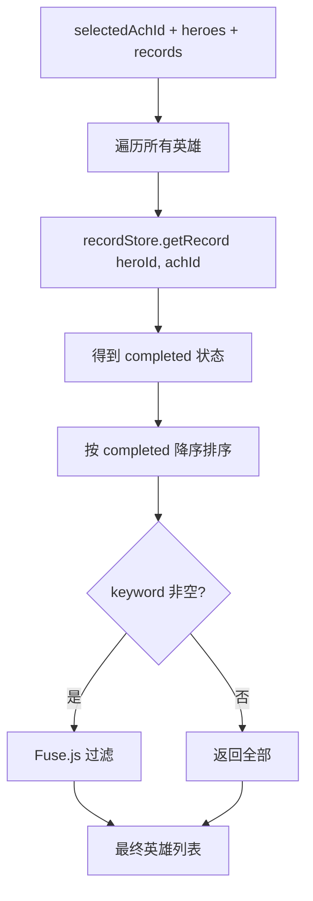

# 成就维度视图 - 技术方案

## 1. 技术选型

沿用现有技术栈，无新增依赖：

| 技术 | 用途 |
|------|------|
| Vue 3 Composition API | 组件开发 |
| Pinia | 状态管理（复用现有 stores） |
| Tailwind CSS | 样式 |
| Fuse.js + pinyin-pro | 搜索（复用现有 search engine） |

## 2. 架构设计

在主页 `Home.vue` 中集成视图切换，成就维度视图作为新组件嵌入，数据层完全复用现有 stores。



## 3. 数据结构

无需新增数据结构，完全复用现有 stores：

- `achievementStore.achievements` → 成就列表
- `recordStore.getRecord(heroId, achId)` → 单条记录查询
- `heroStore.heroes` → 英雄列表

新增一个工具函数（在 record store 中）：

```javascript
// recordStore 新增方法
function getAchProgress(achId, heroIds) {
  const completed = heroIds.filter(id =>
    records.value[id]?.[achId]?.completed
  ).length
  return { completed, total: heroIds.length }
}
```

## 4. 接口设计

### 4.1 Home.vue 改造

新增 `viewMode` ref 控制视图切换：

```
viewMode: Ref<'hero' | 'achievement'>
```

模板中根据 viewMode 条件渲染对应视图。

### 4.2 AchievementView 组件（新增）

```typescript
Props: 无（直接从 stores 读取数据）
内部状态:
  - selectedAchId: Ref<string>     // 当前选中的成就 ID
  - keyword: Ref<string>           // 搜索关键词
逻辑:
  - 从 achievementStore 获取成就列表
  - 从 heroStore 获取英雄列表
  - 从 recordStore 查询每条记录
  - 按完成状态排序（已完成在前）
  - 搜索过滤（复用 createSearchEngine）
```

### 4.3 AchievementHeroCard 组件（新增）

```typescript
Props:
  - hero: Object        // 英雄数据
  - completed: Boolean  // 该成就是否完成
  - completedAt: String // 完成时间（可选）

展示:
  - 英雄头像（复用现有样式）
  - 英雄名称
  - 完成状态标识（勾选图标 / 灰色遮罩）
  - 点击跳转到 /hero/:id
```

## 5. 核心逻辑

### 5.1 视图切换流程



### 5.2 成就维度数据计算



### 5.3 搜索复用

搜索逻辑完全复用 `utils/search.js` 中的 `createSearchEngine`，在 `AchievementView` 内部独立维护一份 searchEngine 实例（与 Home.vue 中的 hero 维度搜索互不影响）。

## 6. 文件结构

| 操作 | 文件路径 | 职责 |
|------|----------|------|
| 修改 | `src/views/Home.vue` | 添加 viewMode 切换逻辑和 UI |
| 新增 | `src/components/achievement/AchievementView.vue` | 成就维度主视图（选择器+进度+列表） |
| 新增 | `src/components/achievement/AchievementHeroCard.vue` | 成就维度下的英雄卡片 |
| 修改 | `src/stores/record.js` | 新增 `getAchProgress` 方法 |

## 7. 风险与对策

| 风险 | 影响 | 对策 |
|------|------|------|
| 两个视图各自维护 searchEngine 实例 | 内存占用增加 | Fuse.js 实例轻量（170条数据），可忽略 |
| 切换视图时搜索状态互相独立 | 用户体验 | 每个视图维护独立的 keyword ref |
| 成就数量多时选择器溢出 | UI 问题 | 选择器使用横向滚动容器 |
| 大量英雄卡片渲染性能 | 列表卡顿 | 170+ 卡片在现代浏览器无压力，暂不虚拟滚动 |
