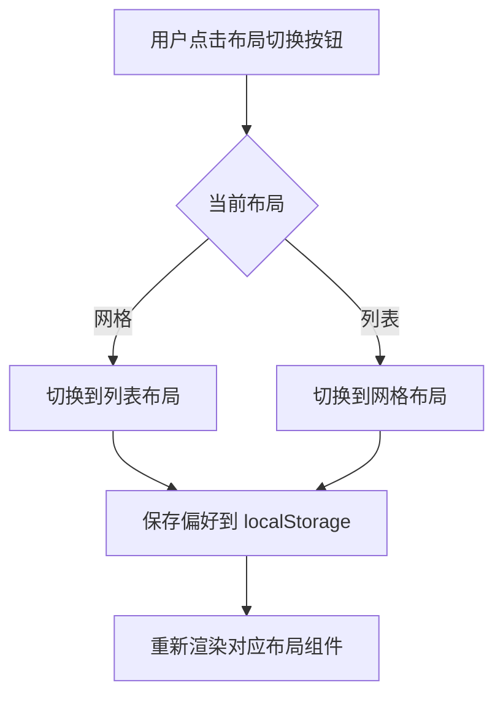
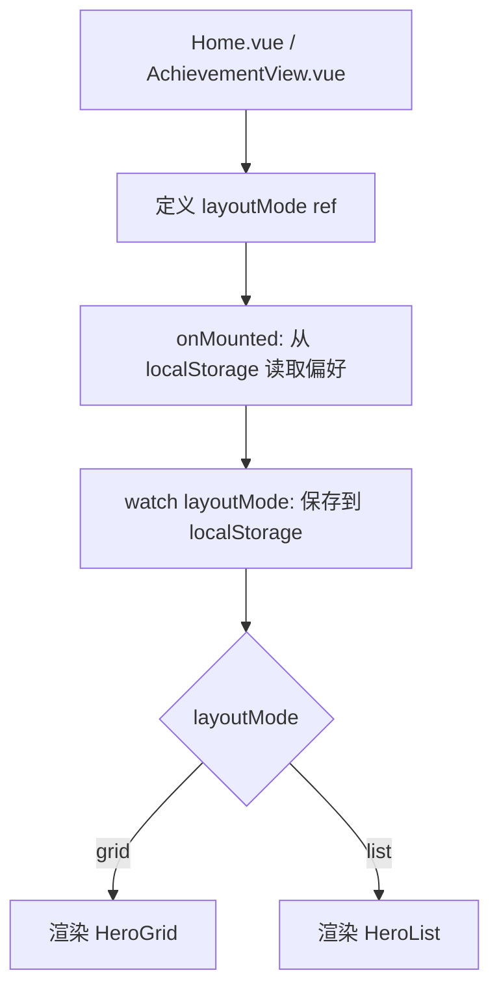

# 英雄列表布局切换 - 技术方案

## 1. 技术选型

| 技术 | 用途 |
|------|------|
| Vue 3 Composition API | 组件开发 |
| Tailwind CSS | 样式实现 |
| Lucide Vue Next | 图标（Grid3X3, List, ChevronDown） |
| localStorage | 布局偏好存储 |
| CSS Transition | 展开/折叠动画 |

## 2. 架构设计

### 组件层级

```
Home.vue
├── 布局切换按钮 (新增)
├── HeroSearch
├── HeroGrid (现有，网格布局)
│   └── HeroCard
└── HeroList (新增，列表布局)
    └── HeroListCard (新增)
        ├── 折叠状态：头像 + 名称 + 称号
        └── 展开状态：角色标签 + 成就进度

AchievementView.vue
├── 布局切换按钮 (新增)
├── HeroGrid (现有，网格布局)
│   └── AchievementHeroCard
└── HeroList (新增，列表布局)
    └── HeroListCard (新增，带成就状态)
```

### 布局切换流程



## 3. 数据结构

### 布局偏好存储

```javascript
// localStorage key: 'lol_layout_preference'
{
  heroLayout: 'grid' | 'list',       // 英雄tab布局
  achievementLayout: 'grid' | 'list'  // 成就tab布局
}
```

### HeroListCard Props

```typescript
interface HeroListCardProps {
  hero: {
    heroId: string
    name: string
    title: string
    avatar: string
    roles?: string[]
  }
  // 成就tab专用
  completed?: boolean
  completedAt?: string
  // 列表容器专用
  achievements?: Array<{
    id: string
    name: string
    completed: boolean
  }>
}
```

## 4. 接口设计

### HeroList 组件

```vue
<HeroList
  :heroes="filteredHeroes"
  :loading="loading"
/>
```

### HeroListCard 组件

```vue
<HeroListCard
  :hero="hero"
  :completed="completed"
  :completed-at="completedAt"
  :achievements="achievements"
/>
```

**Events:**
- 无（点击展开/折叠为组件内部状态）

## 5. 核心逻辑

### 5.1 布局切换逻辑



### 5.2 展开/折叠逻辑

- 使用 `ref(false)` 控制每个卡片的展开状态
- 点击卡片切换展开状态
- 使用 Vue 的 `<Transition>` 组件实现平滑动画
- 展开内容区域使用 `max-height` + `overflow-hidden` 实现动画

### 5.3 成就进度计算

在英雄tab的列表视图中，展开后显示成就进度：
- 使用 `useAchievementStore` 获取成就总数
- 使用 `useRecordStore` 获取英雄的成就完成情况
- 复用现有的 `getHeroProgress` 方法

## 6. 文件结构

### 新增文件

| 文件路径 | 职责 |
|----------|------|
| `src/components/hero/HeroList.vue` | 列表布局容器组件 |
| `src/components/hero/HeroListCard.vue` | 横向卡片组件（支持折叠/展开） |

### 修改文件

| 文件路径 | 修改内容 |
|----------|----------|
| `src/views/Home.vue` | 添加布局切换按钮，集成 HeroList |
| `src/components/achievement/AchievementView.vue` | 添加布局切换按钮，集成 HeroList |
| `src/styles/main.css` | 可能需要添加展开/折叠动画样式 |

## 7. 风险与对策

| 风险 | 对策 |
|------|------|
| 大量英雄列表渲染性能 | 使用 `v-memo` 优化，或考虑虚拟滚动 |
| 展开/折叠动画卡顿 | 使用 CSS transform 而非 height 动画 |
| 移动端适配 | 使用响应式类名调整布局 |
| 布局切换时状态丢失 | 展开状态为组件内部状态，切换时自然重置 |
