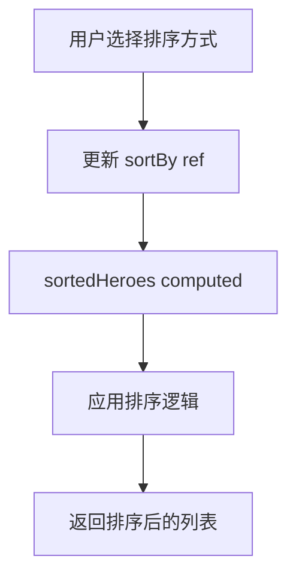

# 英雄列表排序功能 - 技术方案

## 1. 技术选型

| 技术 | 用途 |
|------|------|
| Vue 3 Composition API | 组件开发 |
| pinyin-pro | 拼音转换 |
| Lucide Vue Next | 图标（ArrowUpDown） |
| localStorage | 排序偏好存储 |

## 2. 架构设计

### 组件结构

```
Home.vue
├── HeroSearch.vue
├── HeroSortSelect.vue (新增：排序选择器)
├── HeroGrid.vue / HeroList.vue
└── ...
```

### 排序流程



## 3. 数据结构

### 排序选项

```typescript
interface SortOption {
  value: string      // 排序值
  label: string      // 显示文本
  icon?: Component   // 图标（可选）
}

const sortOptions: SortOption[] = [
  { value: 'default', label: '默认排序' },
  { value: 'alias-asc', label: '英文名 A→Z' },
  { value: 'alias-desc', label: '英文名 Z→A' },
  { value: 'pinyin-asc', label: '拼音名 A→Z' },
  { value: 'pinyin-desc', label: '拼音名 Z→A' },
  { value: 'achievements-desc', label: '成就多→少' },
  { value: 'achievements-asc', label: '成就少→多' },
]
```

### 排序偏好存储

```javascript
// localStorage key: 'lol_hero_sort'
// value: 'default' | 'alias-asc' | 'alias-desc' | 'pinyin-asc' | 'pinyin-desc' | 'achievements-desc' | 'achievements-asc'
```

## 4. 接口设计

### HeroSortSelect 组件

```vue
<HeroSortSelect v-model="sortBy" />
```

**Props:**
- `modelValue`: string - 当前排序值

**Events:**
- `update:modelValue`: 排序值变化时触发

## 5. 核心逻辑

### 排序算法

```javascript
function sortHeroes(heroes, sortBy, records) {
  const sorted = [...heroes]

  switch (sortBy) {
    case 'default':
      return sorted.sort((a, b) => Number(a.heroId) - Number(b.heroId))

    case 'alias-asc':
      return sorted.sort((a, b) => a.alias.localeCompare(b.alias))

    case 'alias-desc':
      return sorted.sort((a, b) => b.alias.localeCompare(a.alias))

    case 'pinyin-asc':
      return sorted.sort((a, b) => pinyin(a.name).localeCompare(pinyin(b.name)))

    case 'pinyin-desc':
      return sorted.sort((a, b) => pinyin(b.name).localeCompare(pinyin(a.name)))

    case 'achievements-desc':
      return sorted.sort((a, b) => getAchievementCount(b) - getAchievementCount(a))

    case 'achievements-asc':
      return sorted.sort((a, b) => getAchievementCount(a) - getAchievementCount(b))

    default:
      return sorted
  }
}
```

## 6. 文件结构

### 新增文件

| 文件路径 | 职责 |
|----------|------|
| `packages/frontend/src/components/hero/HeroSortSelect.vue` | 排序选择器组件 |

### 修改文件

| 文件路径 | 修改内容 |
|----------|----------|
| `packages/frontend/src/views/Home.vue` | 集成排序选择器，实现排序逻辑 |
| `packages/frontend/src/composables/useSortPreference.js` | 排序偏好 composable（可选） |

## 7. 风险与对策

| 风险 | 对策 |
|------|------|
| 拼音排序性能 | 缓存拼音结果，避免重复计算 |
| 成就数量排序 | 需要关联 records 计算，可能影响性能 |
| 排序稳定性 | 使用稳定的排序算法 |
