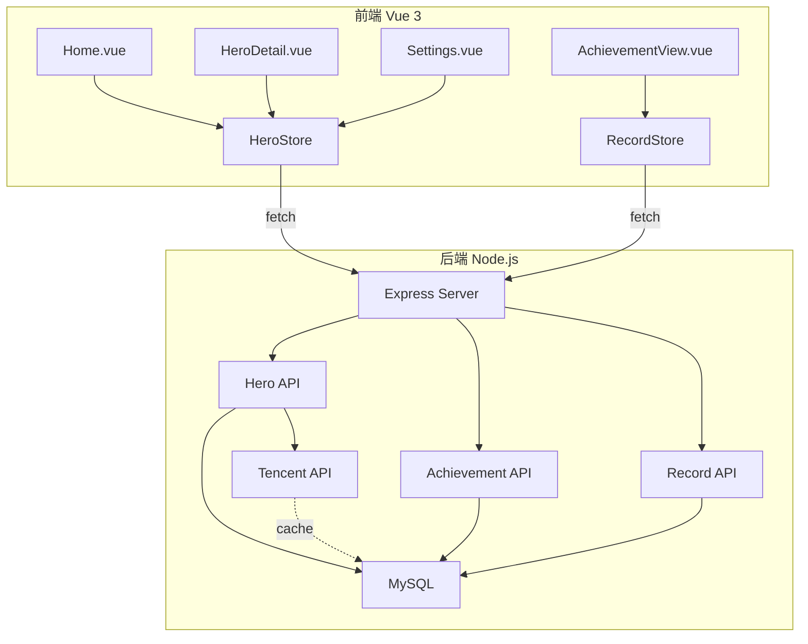
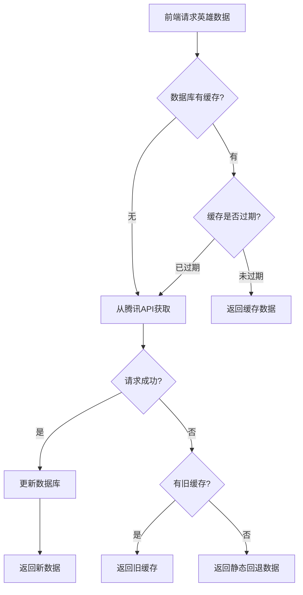

# MySQL 数据库集成 - 技术方案

## 1. 技术选型

| 技术 | 用途 | 说明 |
|------|------|------|
| Node.js | 后端运行时 | 与前端技术栈一致 |
| Express | Web 框架 | 轻量、流行 |
| mysql2 | MySQL 驱动 | 支持 Promise |
| cors | 跨域支持 | 允许前端访问 |
| dotenv | 环境变量 | 管理配置信息 |
| node-cron | 定时任务 | 自动检查缓存过期 |

## 2. 架构设计

### 整体架构



### 目录结构

```
lolachievements/
├── server/                     # 新增：后端服务
│   ├── index.js                # 服务入口
│   ├── config/
│   │   └── db.js               # 数据库配置
│   ├── routes/
│   │   ├── heroes.js           # 英雄数据 API
│   │   ├── achievements.js     # 成就定义 API
│   │   └── records.js          # 成就记录 API
│   ├── services/
│   │   ├── heroService.js      # 英雄数据业务逻辑
│   │   └── crawlerService.js   # 腾讯 API 爬取
│   ├── scripts/
│   │   └── init-db.sql         # 数据库初始化脚本
│   └── package.json
├── src/                        # 前端代码（修改）
│   ├── stores/
│   │   ├── hero.js             # 修改：接入 API
│   │   ├── achievement.js      # 修改：接入 API
│   │   └── record.js           # 修改：接入 API
│   └── views/
│       └── HeroDetail.vue      # 修改：显示英文名
└── .env                        # 新增：环境变量
```

## 3. 数据结构

### 数据库表设计

#### heroes 表（英雄数据缓存）

```sql
CREATE TABLE heroes (
  hero_id VARCHAR(10) PRIMARY KEY,
  name VARCHAR(50) NOT NULL COMMENT '中文名',
  title VARCHAR(50) NOT NULL COMMENT '中文称号',
  alias VARCHAR(50) NOT NULL COMMENT '英文名',
  avatar VARCHAR(255) NOT NULL COMMENT '头像URL',
  roles JSON COMMENT '角色标签',
  fetched_at DATETIME NOT NULL COMMENT '数据拉取时间',
  created_at DATETIME DEFAULT CURRENT_TIMESTAMP,
  updated_at DATETIME DEFAULT CURRENT_TIMESTAMP ON UPDATE CURRENT_TIMESTAMP,
  INDEX idx_fetched_at (fetched_at)
);
```

#### achievements 表（成就定义）

```sql
CREATE TABLE achievements (
  id VARCHAR(20) PRIMARY KEY,
  name VARCHAR(100) NOT NULL,
  description TEXT,
  created_at DATETIME DEFAULT CURRENT_TIMESTAMP
);
```

#### records 表（成就记录）

```sql
CREATE TABLE records (
  id INT AUTO_INCREMENT PRIMARY KEY,
  hero_id VARCHAR(10) NOT NULL,
  achievement_id VARCHAR(20) NOT NULL,
  completed BOOLEAN DEFAULT FALSE,
  completed_at DATETIME,
  note TEXT,
  UNIQUE KEY uk_hero_ach (hero_id, achievement_id),
  FOREIGN KEY (hero_id) REFERENCES heroes(hero_id),
  FOREIGN KEY (achievement_id) REFERENCES achievements(id)
);
```

### API 响应格式

```json
{
  "code": 0,
  "data": {},
  "message": "success"
}
```

## 4. 接口设计

### 英雄数据 API

| 方法 | 路径 | 说明 |
|------|------|------|
| GET | `/api/heroes` | 获取所有英雄（优先从缓存） |
| GET | `/api/heroes/:id` | 获取单个英雄 |
| POST | `/api/heroes/refresh` | 强制刷新英雄数据 |
| GET | `/api/heroes/status` | 获取缓存状态（最后更新时间） |

### 成就 API

| 方法 | 路径 | 说明 |
|------|------|------|
| GET | `/api/achievements` | 获取所有成就定义 |
| POST | `/api/achievements` | 创建成就 |
| PUT | `/api/achievements/:id` | 更新成就 |
| DELETE | `/api/achievements/:id` | 删除成就 |

### 记录 API

| 方法 | 路径 | 说明 |
|------|------|------|
| GET | `/api/records` | 获取所有记录 |
| GET | `/api/records/:heroId` | 获取英雄的记录 |
| POST | `/api/records/toggle` | 切换完成状态 |
| PUT | `/api/records/note` | 更新备注 |

## 5. 核心逻辑

### 英雄数据缓存流程



### 缓存过期判断

```javascript
// 缓存有效期：30天
const CACHE_DURATION = 30 * 24 * 60 * 60 * 1000

function isCacheExpired(fetchedAt) {
  const fetchedTime = new Date(fetchedAt).getTime()
  return Date.now() - fetchedTime > CACHE_DURATION
}
```

## 6. 文件结构

### 新增文件

| 文件路径 | 职责 |
|----------|------|
| `server/index.js` | Express 服务入口 |
| `server/config/db.js` | 数据库连接配置 |
| `server/routes/heroes.js` | 英雄数据路由 |
| `server/routes/achievements.js` | 成就定义路由 |
| `server/routes/records.js` | 成就记录路由 |
| `server/services/heroService.js` | 英雄数据业务逻辑 |
| `server/services/crawlerService.js` | 腾讯 API 爬取 |
| `server/scripts/init-db.sql` | 数据库初始化脚本 |
| `server/package.json` | 后端依赖配置 |
| `.env` | 环境变量配置 |

### 修改文件

| 文件路径 | 修改内容 |
|----------|----------|
| `src/stores/hero.js` | 接入后端 API |
| `src/stores/achievement.js` | 接入后端 API |
| `src/stores/record.js` | 接入后端 API |
| `src/views/HeroDetail.vue` | 显示英文名、英文称号 |
| `src/views/Settings.vue` | 显示数据更新时间 |
| `package.json` | 添加启动脚本 |

## 7. 风险与对策

| 风险 | 对策 |
|------|------|
| MySQL 连接失败 | 服务启动时检查连接，给出明确错误提示 |
| 腾讯 API 请求失败 | 保留静态回退机制，使用过期缓存 |
| 数据迁移失败 | 保留 localStorage 数据，支持手动迁移 |
| 服务端口冲突 | 使用环境变量配置端口，默认 3001 |
| 跨域问题 | 配置 CORS 允许前端域名访问 |
