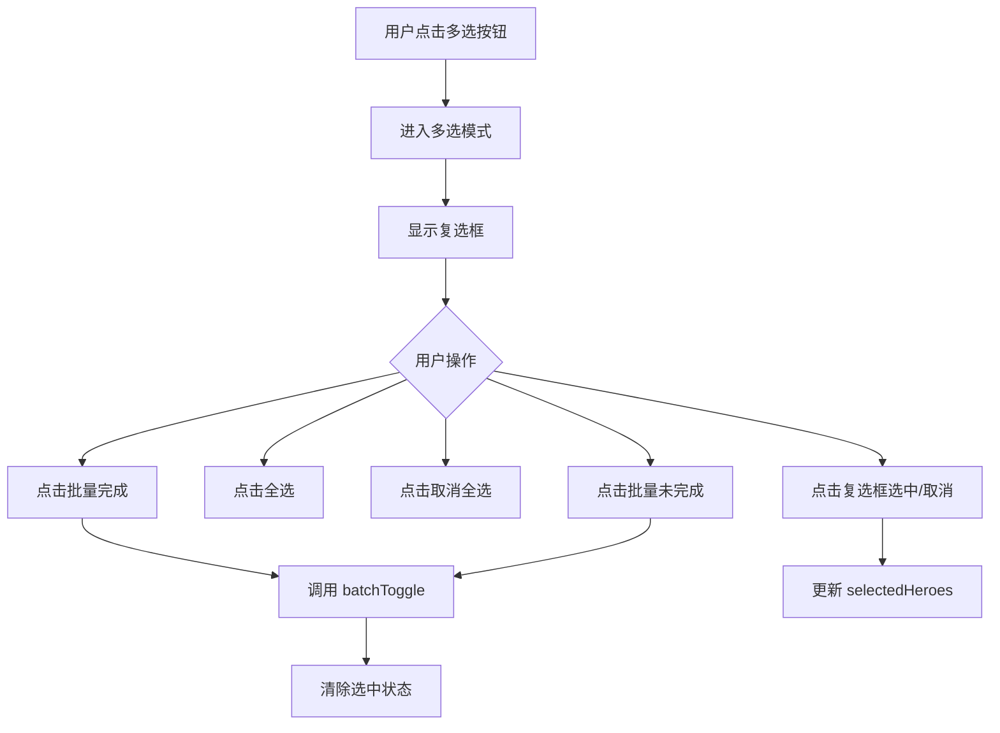

# 成就维度页面排序与多选 - 技术方案

## 1. 技术选型

- Vue 3 Composition API（现有技术栈）
- Tailwind CSS（样式）
- lucide-vue-next（图标：Check, Square, CheckSquare 等）
- useLayoutPreference composable（排序偏好持久化）

## 2. 架构设计

```
Home.vue
└── AchievementView.vue (修改)
    ├── HeroSortSelect.vue (复用，添加排序选项)
    ├── AchievementHeroCard.vue (修改，添加 checkbox)
    └── HeroListCard.vue (修改，添加 checkbox)

stores/record.js (修改，添加 batchToggle 方法)
```

## 3. 数据结构

### 排序选项扩展

在 `AchievementView` 中定义成就维度专用排序选项：

```js
const achSortOptions = [
  { value: 'incomplete-first', label: '未完成优先' },
  { value: 'completed-first', label: '已完成优先' },
  { value: 'pinyin-asc', label: '中文名 A→Z' },
  { value: 'pinyin-desc', label: '中文名 Z→A' },
  { value: 'alias-asc', label: '英文名 A→Z' },
  { value: 'alias-desc', label: '英文名 Z→A' },
  { value: 'name-asc', label: '称号 A→Z' },
  { value: 'name-desc', label: '称号 Z→A' },
]
```

### 多选状态

```js
const selectedHeroes = ref(new Set()) // 存储 heroId
const isMultiSelectMode = ref(false)  // 是否进入多选模式
```

## 4. 接口设计

### recordStore 新增方法

```js
async function batchToggle(heroIds, achId) {
  // 逐个调用 toggle API，使用 Promise.allSettled 并发
  const results = await Promise.allSettled(
    heroIds.map(id => toggle(id, achId))
  )
  return results
}
```

### HeroSortSelect 组件接口

不修改 HeroSortSelect 组件本身。在 AchievementView 中直接实现排序下拉，因为排序选项和逻辑与英雄维度不同，复用组件反而增加耦合。

## 5. 核心逻辑

### 排序逻辑

```js
const sortedHeroes = computed(() => {
  const list = heroStatusList.value // 带完成状态的英雄列表
  switch (achSort.value) {
    case 'incomplete-first':
      return list.sort((a, b) => (a.completed === b.completed ? 0 : a.completed ? 1 : -1))
    case 'completed-first':
      return list.sort((a, b) => (a.completed === b.completed ? 0 : a.completed ? -1 : 1))
    case 'pinyin-asc':
      return list.sort((a, b) => getPinyin(a.hero.title).localeCompare(getPinyin(b.hero.title)))
    // ... 其他排序
  }
})
```

### 多选流程



## 6. 文件结构

| 文件 | 操作 | 说明 |
|------|------|------|
| `AchievementView.vue` | 修改 | 添加排序逻辑、多选状态管理、操作栏 UI |
| `AchievementHeroCard.vue` | 修改 | 添加 checkbox 支持 |
| `HeroListCard.vue` | 修改 | 添加 checkbox 支持（成就维度模式） |
| `stores/record.js` | 修改 | 添加 batchToggle 方法 |

## 7. 风险与对策

| 风险 | 对策 |
|------|------|
| 批量 toggle 并发请求过多 | 使用 Promise.allSettled 控制并发，不额外限制（英雄数量有限） |
| 多选状态与搜索过滤交互 | 全选仅作用于当前过滤结果，保留搜索外的选中状态 |
